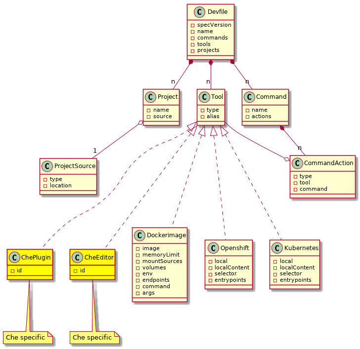
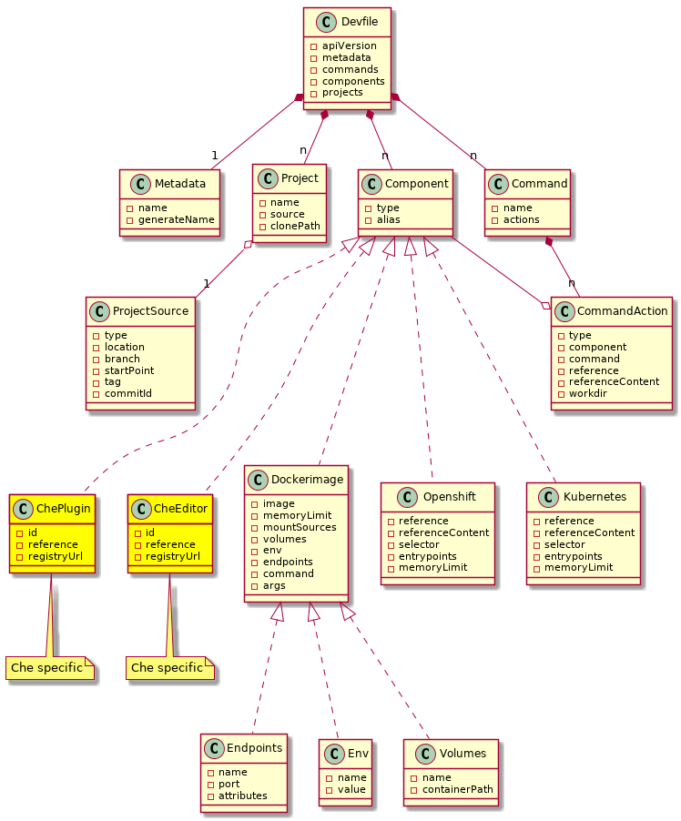

# devfile v1

This repository contains the specs, docs and examples of the Devfile v1.

For Devfile v2 go [here](https://docs.devfile.io). 

See explained devfile v1 documentation with examples at https://redhat-developer.github.io/devfile/

## First Generation:

[Diagram source (plantuml)](devfile.plantuml)

## Next Generation:

[Diagram source (plantuml)](devfile_next.plantuml)
