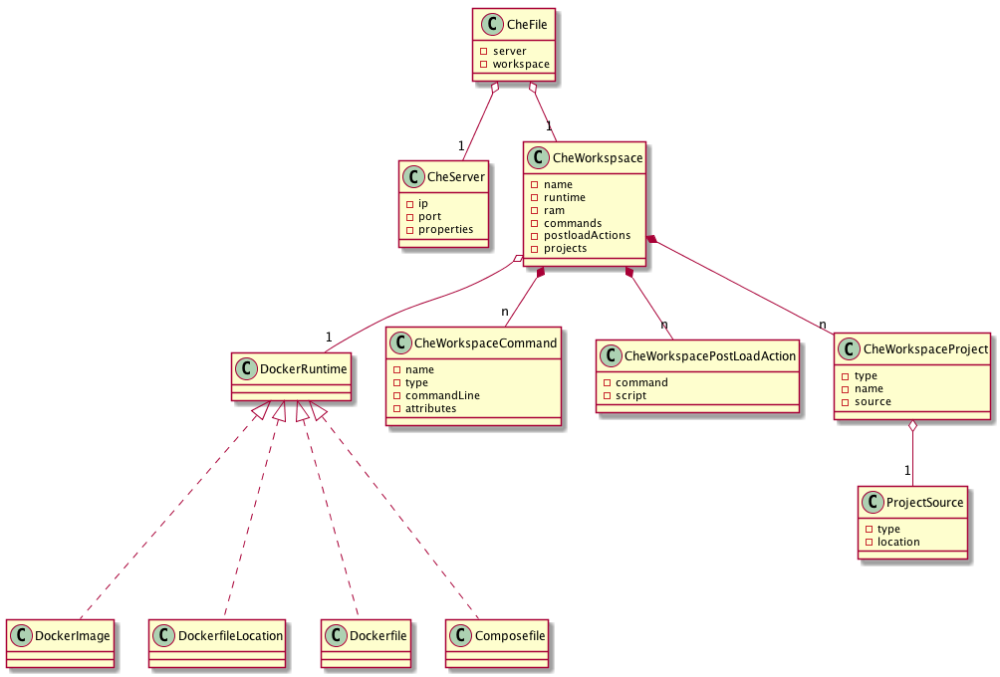
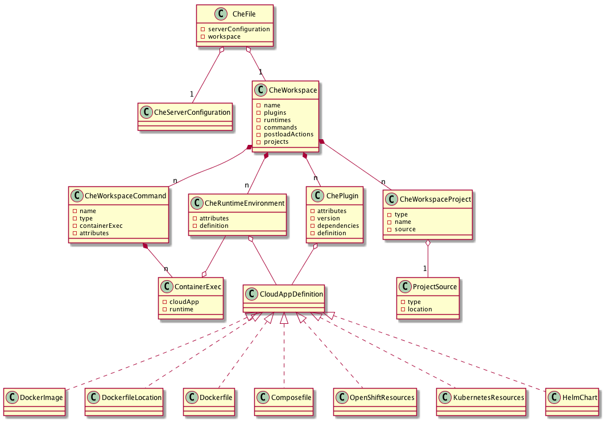

# devfile

## First Generation: chefile

[Diagram source (plantuml)](chefile.plantuml)

## Second Generation: chefile.next

Chefile updated with workspace.next model

[Diagram source (plantuml)](chefile.next.plantuml)

## Third Generation: devfile

Chefile.next made non che specific

[Diagram source (plantuml)](devfile.plantuml)